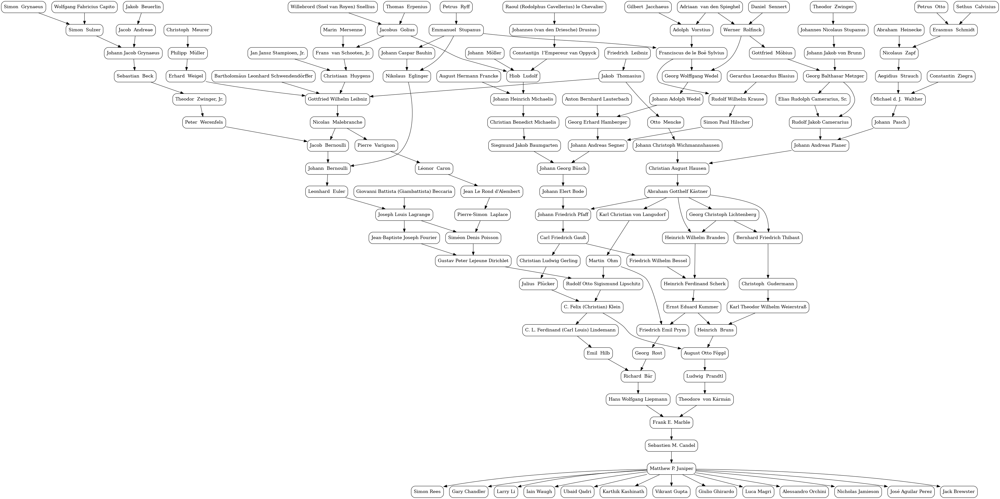

# MathDjinn

Search [Mathematics Genealogy Project](https://www.genealogy.math.ndsu.nodak.edu/) database, and visualize graph.

Support via [donations](https://northdakotastate-ndus.nbsstore.net/mathematics-genealogy-project-donation) and [poster orders](https://www.mathgenealogy.org/posters.php).

## Requirements

You need the following programs:

*   `dot`

On Ubuntu, execute the following command to install the programs:

    sudo apt-get install graphviz

## Instructions

Run the following example:

    make juniper

It generates the following image:

